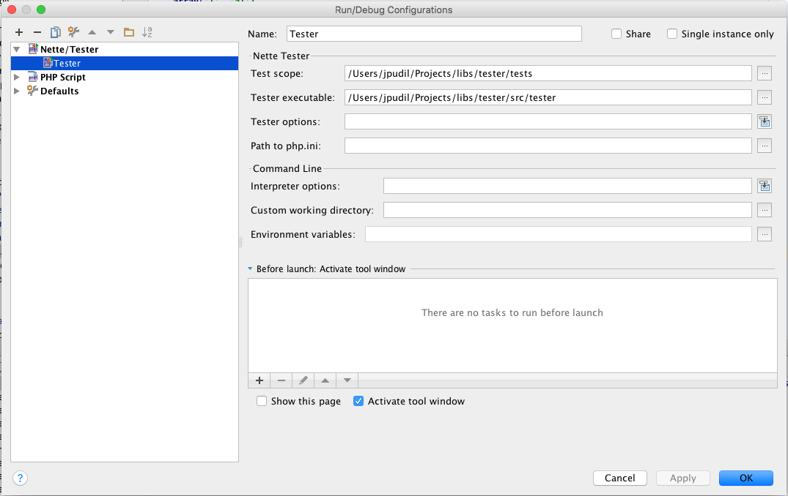
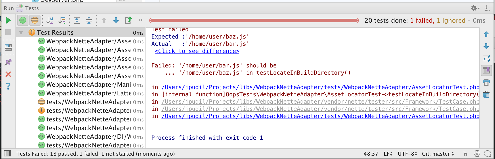
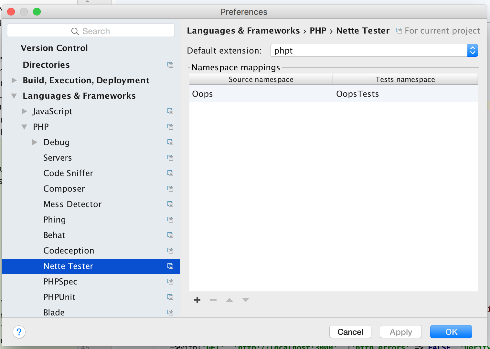
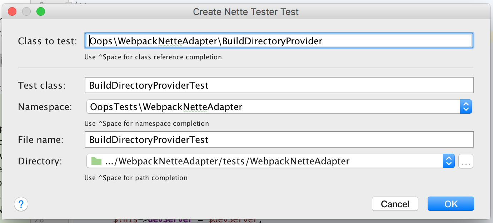
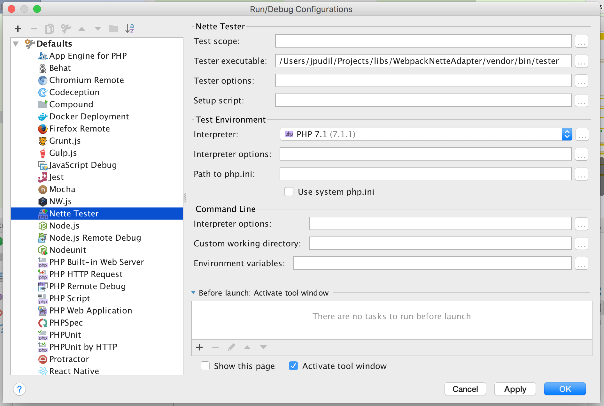

# Nette Tester integration into PhpStorm

This plugin integrates [Nette Tester](https://tester.nette.org) into PhpStorm IDE.

## Installation and requirements

This plugin is written for PhpStorm 2016.3 and above and is compiled for Java 8. You can find it in the Jetbrains plugin repository. Install it from Preferences → Plugins → Browse repositories... and search for `Tester`.

## Usage

### Configuration

This plugin provides a new configuration type for Nette Tester:

- **Test scope** is the directory containing the tests you wish to run.
- **Tester executable** specifies path to the Tester runner (`/path/to/your/project/vendor/bin/tester` if you installed Tester via Composer).
- **Tester options** allows you to specify options for Tester script (refer to the [docs](https://tester.nette.org/en/)). This field serves for options you cannot specify otherwise (see below).
- **Setup script** allows you to specify the setup script (`--setup` option). You can leave this field blank if you don't use any.
- **Interpreter** and **interpreter options** allow you to modify the environment in which your tests run (`-p` option and `-d` options).
- **Path to php.ini** specifies the configuration file to use (`-c` option). You can leave this field blank, in which case tests will run without any configuration loaded.

#### Usage on Windows

Composer seems to do some necessary, but unfortunate transformations on vendor binaries. Therefore you need to point the **Tester executable** option to the actual PHP file in `/path/to/your/project/vendor/nette/tester/src/tester.php`.

### Interpreting results

If you now run this configuration, test results will start to show in the Test Runner window:

To the left, there is a list of tests. You can toggle showing passed and skipped tests. If you click the test, you will see the detailed output in the console window to the right.

### Navigating between a class and its test

You can navigate between a class and its test, or create a test for a class easily, via Navigate → Test.

The navigation is based on convention (class name + `Test` suffix), the creation assumes your tests reside in the same namespace as the code; if you use a different scheme, you can configure source to test namespace mapping in the project settings under Languages & Frameworks → PHP → Nette Tester.

If you create a test for a class, the dialog now follows your namespace mapping and automatically updates the target test namespace (and directory, following the Directories project settings).

### Running tests from a directory

You can right-click a directory to run the tests within it. For this to be truly a one-click action, you should configure the Tester executable in the Nette Tester default run configuration template.

